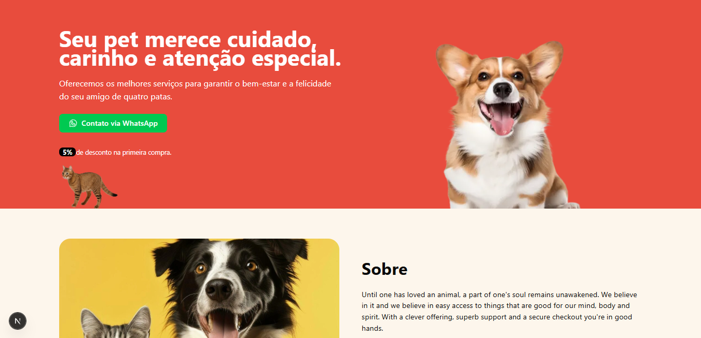

<h1 align="center"> 🐾 PetLovers – Cuidando com Amor </h1>

<p align="center">
Until one has loved an animal, a part of one's soul remains unawakened.
</p>

<p align="center">
  <a href="#-sobre-o-projeto">Sobre o Projeto</a>&nbsp;&nbsp;&nbsp;|&nbsp;&nbsp;&nbsp;
  <a href="#-tecnologias-utilizadas">Tecnologias Utilizadas</a>&nbsp;&nbsp;&nbsp;|&nbsp;&nbsp;&nbsp;
  <a href="#-instalação">Instalação</a>&nbsp;&nbsp;&nbsp;|&nbsp;&nbsp;&nbsp;
  <a href="#-licença">Licença</a>&nbsp;&nbsp;&nbsp;|&nbsp;&nbsp;&nbsp;
  <a href="#-contato">Contato</a>
</p>

<p align="center">
  
</p>


<br>

Nós acreditamos profundamente nisso, e também acreditamos que o acesso a conteúdos que fazem bem para a mente, o corpo e o espírito deve ser simples, bonito e funcional.

## ✨ Sobre o Projeto

**PetLovers** é um blog desenvolvido para compartilhar nosso PetShop, cuidados e amor pelos animais. O foco está na experiência do usuário, com uma interface responsiva, fluida e repleta de animações sutis que tornam a navegação mais agradável.

## 🧪 Tecnologias Utilizadas

* **[Next.js](https://nextjs.org/)** – Framework React para SSR e performance otimizada
* **TypeScript** – Tipagem estática para maior robustez no código
* **[Tailwind CSS](https://tailwindcss.com/)** – Utilizado para estilização rápida e responsiva
* **[AOS (Animate On Scroll)](https://michalsnik.github.io/aos/)** – Biblioteca de animações que traz vida aos elementos ao rolar a página
* **[Lucide React](https://lucide.dev/)** & **[Phosphor Icons](https://phosphoricons.com/)** – Ícones modernos e flexíveis
* **[Embla Carousel](https://www.embla-carousel.com/)** – Carrossel leve e altamente customizável usado para sliders

## 📦 Instalação

```bash
git clone https://github.com/matheusfdosan/petlovers.git
cd petlovers
npm install
npm run dev
```

## 🐶 Licença

Este projeto está sob a licença [MIT](LICENSE).

## Contato

- Acesse também meus outros repositórios no [Github](https://github.com/matheusfdosan?tab=repositories).
- Também me siga no [Instagram](https://instagram.com/matheusfdosan).
- Conecte-se comingo no [Linkedin](https://www.linkedin.com/in/matheusfaus/)